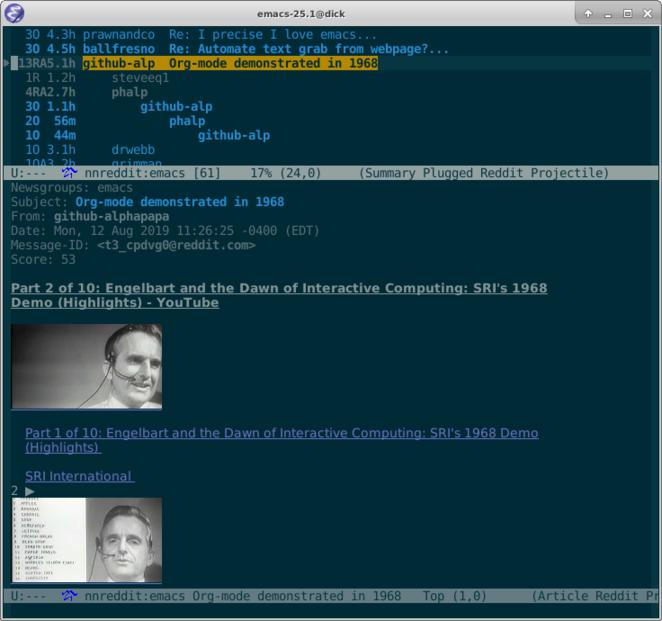

|build-status| |melpa-dev|

.. COMMENTARY (see Makefile)

.. |build-status|
   image:: https://github.com/dickmao/nnreddit/workflows/CI/badge.svg?branch=dev
   :target: https://github.com/dickmao/nnreddit/actions
   :alt: Build Status
.. |melpa-dev|
   image:: https://melpa.org/packages/nnreddit-badge.svg
   :target: http://melpa.org/#/nnreddit
   :alt: MELPA current version
.. |melpa-stable|
   image:: http://melpa-stable.milkbox.net/packages/ein-badge.svg
   :target: http://melpa-stable.milkbox.net/#/ein
   :alt: MELPA stable version

.. image:: https://github.com/dickmao/gnus-imap-walkthrough/blob/master/thumbnail.png
   :target: https://youtu.be/DMpZtC98F_M
   :alt: Replacing Thunderbird With Gnus

.. |--| unicode:: U+2013   .. en dash
.. |---| unicode:: U+2014  .. em dash, trimming surrounding whitespace
   :trim:

We Moved to Gitawonk
====================
https://live.gitawonk.com/dickmao/nnreddit.git

Git paid, not played.

Install
=======
**As of 06 July 2021, authentication behavior at Reddit changed** such that nnreddit versions previous to 0.2.0 no longer work.  Delete ``$HOME/.local/share/nnreddit/refresh-token``, and install the latest nnreddit.

**As of 24 May 2020, to stay apace with the** PRAW_ **backend, nnreddit no longer supports python2.**  If your system keeps python 3.x in a separate alias such as ``python3``, you should ``M-x customize-variable RET nnreddit-python-command`` to it.

We are trying to push ELPASO_ as the preferred package installer.  Alternatively, directly clone this repo and ``make install``.

Also see Troubleshooting_.

Usage
=====
In your ``.emacs`` or ``init.el``, use ONE of the following:

::

   ;; Applies to first-time Gnus users
   (custom-set-variables '(gnus-select-method (quote (nnreddit ""))))

or, if you're an existing Gnus user,

::

   ;; Applies to existing Gnus users
   (add-to-list 'gnus-secondary-select-methods '(nnreddit ""))

Then ``M-x gnus``.

Initial setup should guide you through OAuth and find your existing subreddit subscriptions.

Select a subreddit via ``RET``.  Rapidly catch yourself up via ``N`` and ``P``.  Instantly catch-up with ``c``.

Create a post via ``a``.

Reply to articles with ``f`` or ``r``.  Include original with ``F``.

Vote articles via ``R -`` (down), ``R =`` (up), or ``R 0`` (retract).

From the ``*Group*`` buffer, press ``g`` to refresh all subreddits.  ``M-g`` on a particular subreddit to refresh individually.

From the summary buffer, ``/o`` redisplays articles already read.  ``x`` undisplays them.

``S s`` edits articles.

``S c`` cancels articles.

``R g [subreddit]`` takes you to an *unsubscribed* subreddit.

You can subscribe to it via the ``u`` keybinding from the ``*Group*`` buffer [1]_.

Gnus beginners may find the interface bewildering.  In particular, subreddits with no unread articles do not display.  Use ``L`` to bring them out of hiding.

Troubleshooting
===============
Clone this repo.  Then install Cask_.  Then try ``make test-run-interactive``.

|

.. [1] Gnus users are familiar with the tragedy of ``u`` doing double duty as subscriber and unsubscriber.  ``u`` is really a toggle even though the attached command is ``gnus-group-unsubscribe-current-group`` |---| if that doesn't trigger your UX sensibility, then never mind I mentioned it.

.. _walkthrough: https://github.com/dickmao/gnus-imap-walkthrough
.. _Cask: https://github.com/cask/cask#installation
.. _Getting started: http://melpa.org/#/getting-started
.. _ELPASO: http://github.com/dickmao/elpaso
.. _virtualenv: https://virtualenv.pypa.io/en/stable
.. _PRAW: https://github.com/praw-dev/praw/pull/1094
