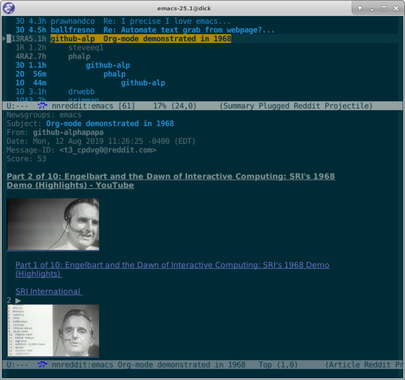

|build-status| |melpa-dev|

A Gnus backend for Reddit.

.. |build-status|
   image:: https://travis-ci.com/dickmao/nnreddit.svg?branch=master
   :target: https://travis-ci.com/dickmao/nnreddit
   :alt: Build Status
.. |melpa-dev|
   image:: https://melpa.org/packages/nnreddit-badge.svg
   :target: http://melpa.org/#/nnreddit
   :alt: MELPA current version
.. |melpa-stable|
   image:: http://melpa-stable.milkbox.net/packages/ein-badge.svg
   :target: http://melpa-stable.milkbox.net/#/ein
   :alt: MELPA stable version

.. |--| unicode:: U+2013   .. en dash
.. |---| unicode:: U+2014  .. em dash, trimming surrounding whitespace
   :trim:

Install
=======
As described in `Getting started`_, ensure melpa's whereabouts in ``init.el`` or ``.emacs``::

   (add-to-list 'package-archives '("melpa" . "https://melpa.org/packages/"))

Then

::

   M-x package-refresh-contents RET
   M-x package-install RET nnreddit RET

Alternatively, directly clone this repo and ``make install``.

Upon first use, ``nnreddit`` will self-install its ``requirements.txt`` which currently consists only of ``virtualenv``.  You can forestall a potential install bug by ensuring your python installation already contains ``virtualenv``.

Also see Troubleshooting_.

Usage
=====
In your ``.emacs`` or ``init.el``, use ONE of the following:

::

   ;; Applies to first-time Gnus users
   (custom-set-variables '(gnus-select-method (quote (nnreddit ""))))

or, if you're an existing Gnus user,

::

   ;; Applies to existing Gnus users
   (add-to-list 'gnus-secondary-select-methods '(nnreddit ""))

Then ``M-x gnus``.

Initial setup should guide you through OAuth and find your existing subreddit subscriptions.

Select a subreddit via ``RET``.  Rapidly catch yourself up via ``N`` and ``P``.  Instantly catch-up with ``c``.

Create a post via ``a``.

Reply to articles with ``f`` or ``r``.  Include original with ``F``.

Vote articles via ``R -`` (down), ``R =`` (up), or ``R 0`` (retract).

From the ``*Group*`` buffer, press ``g`` to refresh all subreddits.  ``M-g`` on a particular subreddit to refresh individually.

From the summary buffer, ``/o`` redisplays articles already read.  ``x`` undisplays them.

``S s`` edits articles.

``S c`` cancels articles.

``R g [subreddit]`` takes you to an *unsubscribed* subreddit.

You can subscribe to it via the ``u`` keybinding from the ``*Group*`` buffer [1]_.

Gnus beginners may find the interface bewildering.  In particular, subreddits with no unread articles do not display.  Use ``L`` to bring them out of hiding.

Troubleshooting
===============
Clone this repo.  Then install Cask_.  Then try ``make test-run-interactive``.

|

.. [1] Gnus users are familiar with the tragedy of ``u`` doing double duty as subscriber and unsubscriber.  ``u`` is really a toggle even though the attached command is ``gnus-group-unsubscribe-current-group`` |---| if that doesn't trigger your UX sensibility, then never mind I mentioned it.

.. _Cask: https://cask.readthedocs.io/en/latest/guide/installation.html
.. _Getting started: http://melpa.org/#/getting-started
